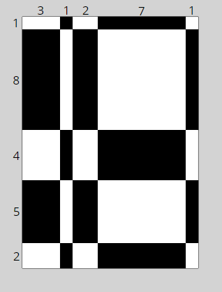

# Find the total white and black areas in a strange chessboard

An eccentric chessboard maker likes to create strange N x N chessboards.
Instead of making all the rows and the columns on his chessboards the same size, he likes to make chessboards with row and columns of varying sizes:

</img>

For example, here are the specifications of his latest 5x5 chessboard:

``cs = [ 3, 1, 2, 7, 1 ] contains the 5 widths of the 5 columns.``

``rs = [ 1, 8, 4, 5, 2 ] contains the 5 heights of the 5 rows.``

To be clear, reading the examples of cs and rs above, the width of the 4th column on the chessboard is 7, the height of the 2nd row on the chessboard is 8, etc.

Notice, by the way, that since sum(cs) != sum(rs), the total width of the strange chessboard is not necessarily the same as the total height.

The chessboard maker now wants to determine how much white and black wood he needs to cover the areas in a given chessboard, so is asking you to find the total white area and the total black area on his board.

---

## Important convention
All his chessboards start with a WHITE CELL IN THE "TOP LEFT", and then alternate black & white in the usual way.

So referring again to cs and rs above, the top left cell on the board is defined by the first column, of width = 3, and the first row, of height = 1, so it has an area = 3*1 = 3 and is colored WHITE due to the coloring convention.

Now as we move around the board, we can consider for example the cell in the board's column 3 & row 4 - it has width = 2 and height = 5, for a total area of 2*5 = 10. It is colored BLACK, as determined by the alternating chessboard coloring pattern and the starting condition of the top left cell being WHITE.

You may want to draw out a 5x5 board with top left cell colored white to make sure you agree with the above results.

---

## Inputs
 - You will be given two lists/arrays, ``cs`` and ``rs``, both of size N.
 - The widths of all N columns represented in cs, and the heights of all N rows represented in rs, will always be integers, and >= 1
 - The size of the chessboard, i.e. the value of N, ranges in 1 <= N <= 41000
 - ``PERFORMANCE REQUIREMENTS``: given the very large N board sizes used in some of the random tests, as explained in part 3 above, **a brute force O(N^2) attempt at solving this kata will timeout...**
## Output
A tuple/struct giving (total_white_area, total_black_area)

---

## To-Do

### Create a test that...
- [ ] Should obtain correct white and black total areas in fixed test boards
- [ ] Should obtain correct white and black total areas in fixed test boards when board only has one component
- [ ] Should obtain correct white and black total areas in 50 randomly generated boards of size 2 < n < 10, and with 1 < widths/heights < 200
- [ ] Should obtain correct white and black total areas in 20 randomly generated boards of size 100 < n < 500, and with 100 < widths/heights < 400
- [ ] Should obtain correct white and black total areas in 100 randomly generated boards of size 2000 < n < 3000, and with 100 < widths/heights < 400
- [ ] Should obtain correct white and black total areas in 10 randomly generated boards of size 40000 < n < 41000, and with 100 < widths/heights < 400